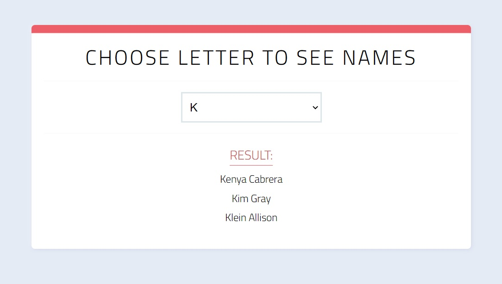

# AlexSoftLab JS
> The first step for the Front end course provided by Lab AltexSoft.

Test task from two parts.This is the second part. 

Need to generate an array of random unique letters and insert them to the select element as options. When the user selects an option, show a list of names from the list.json file where first letter matches with selected option.

